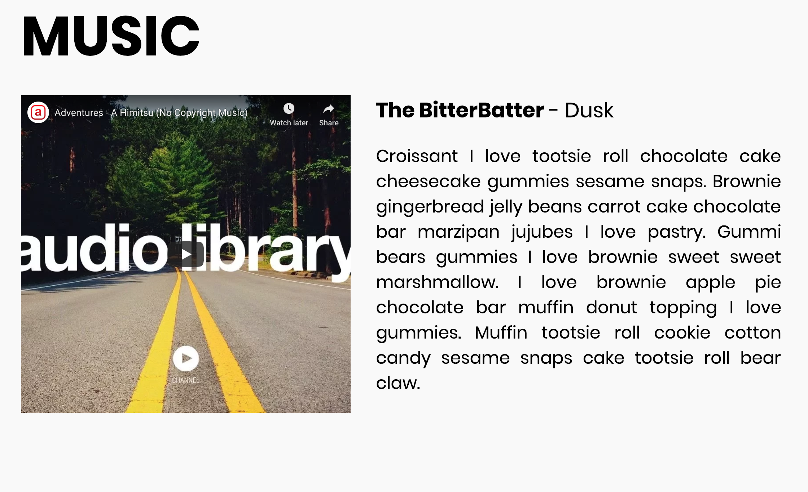
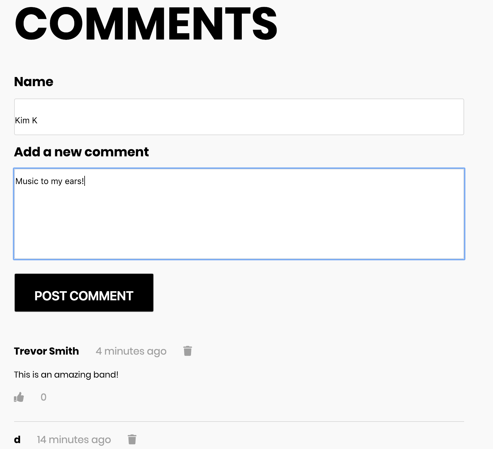

# Band-Site

## Introduction
A band website built with HTML, CSS and jQuery with comments and showdates as API endpoints for the datasource. Utitilized HTTP methods `GET` `POST` `PUT` and `DELETE`.

## Installation
- Find the `index.html` file and open with browser

## API and Authentication 
- this API has a temporary memory, as such it will sometimes forget all of it's comments (except for the two starter comments).
- the comments array starts out with two comments in it already
- URL: `https://project-1-api.herokuapp.com/`
- you must append `?api_key=<your_api_key_here>` to each of your API requests
- - you are free to choose whatever string you want for your API key (like your name)

### `GET /comments`
- Returns an array of comments
- Comments will be regularly cleared
- Timestamp is in ms since epoch.

#### Response Body Example
```
[
    {
        "name": "Nigel",
        "comment": "This is a cool site",
        "id": 1,
        "likes": 0,
        "timestamp": 1530716269495
    }
]
```
### `POST /comments`
- Creates a new comment

#### Headers
```Content-Type | application/json```

#### Post Body Example
```
{
	"name": "Nigel",
	"comment": "What a cool site"
}
```

#### Response Body Example
```
{
    "name": "Nigel",
    "comment": "What a cool site",
    "id": 0,
    "likes": 0,
    "timestamp": 1530744795832
}
```

### `PUT /comments/:id/like`
- Increments the like counter of the comment specified by `:id`
  - swap `:id` for the id of the element you want to like
- No Post body expected
- Will return a 404 if no comment with that ID is found.
- if successful, it will return the `comment` JSON object that you just liked

#### Response Body Example
```
{
    "name": "Nigel",
    "comment": "What a cool site",
    "id": 0,
    "likes": 1,
    "timestamp": 1530744795832
}
```

### `DELETE /comments/:id`
- Deletes the comment specified by `:id`. 
  - swap `:id` for the id of the element you want to delete
- if successful, it will return the `comment` JSON object that you just deleted

#### Response Body Example
```
{
    "name": "Nigel",
    "comment": "What a cool site",
    "id": 0,
    "likes": 0,
    "timestamp": 1530744795832
}
```

### `GET /showdates`
- Returns an array of showtime objects.

#### Response Body Example
```
[
  {
    "id": 0,
    "date": "MON 21 MAY",
    "place": "Montebello Rockfest",
    "location": "Montebello, QC, Canada"
  },
  {
    "id": 1,
    "date": "SAT JUN 16",
    "place": "Coral Sky Ampitheatre",
    "location": "West Palm Beach, FL, United States"
  }
]
```

## Dependencies
- `HTML`
- `CSS`
- `jQuery`
- `SASS`
 

## Final Product





